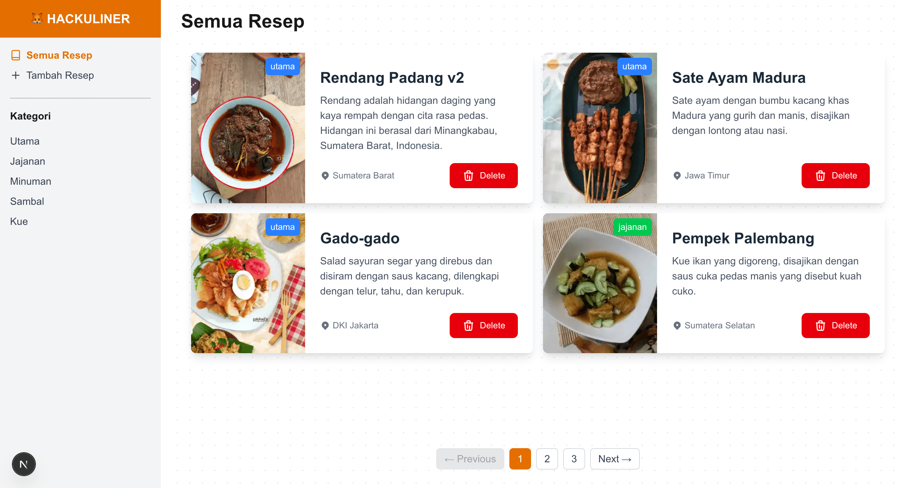
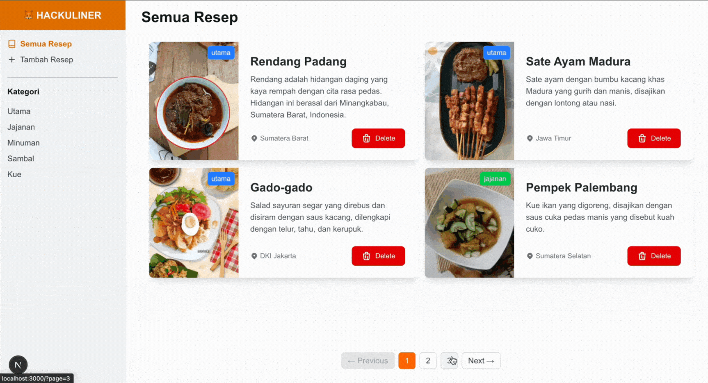
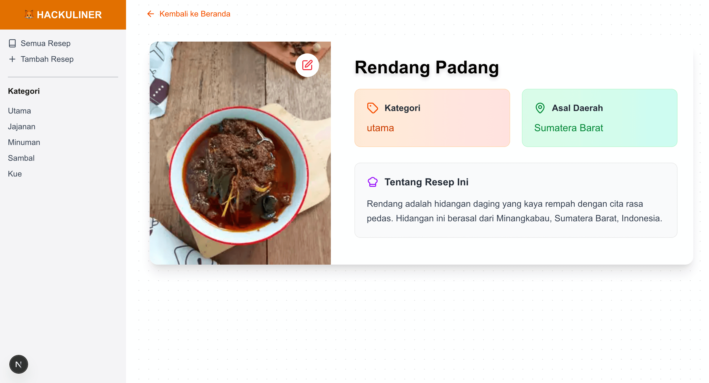
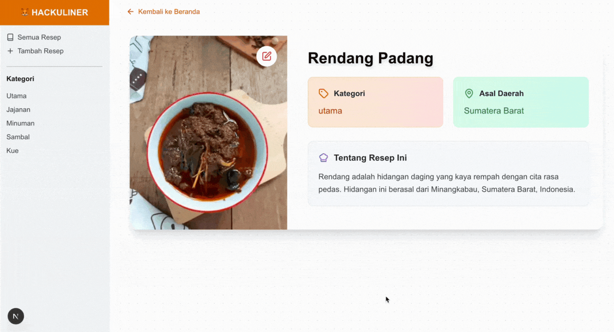
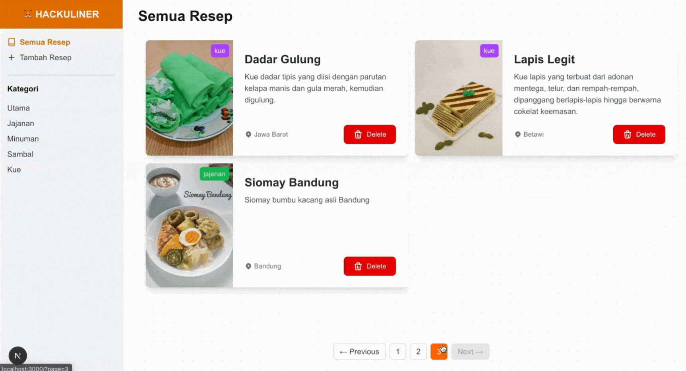
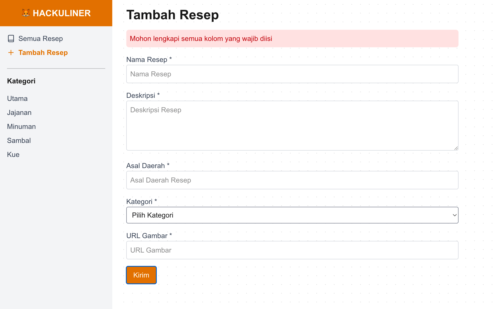
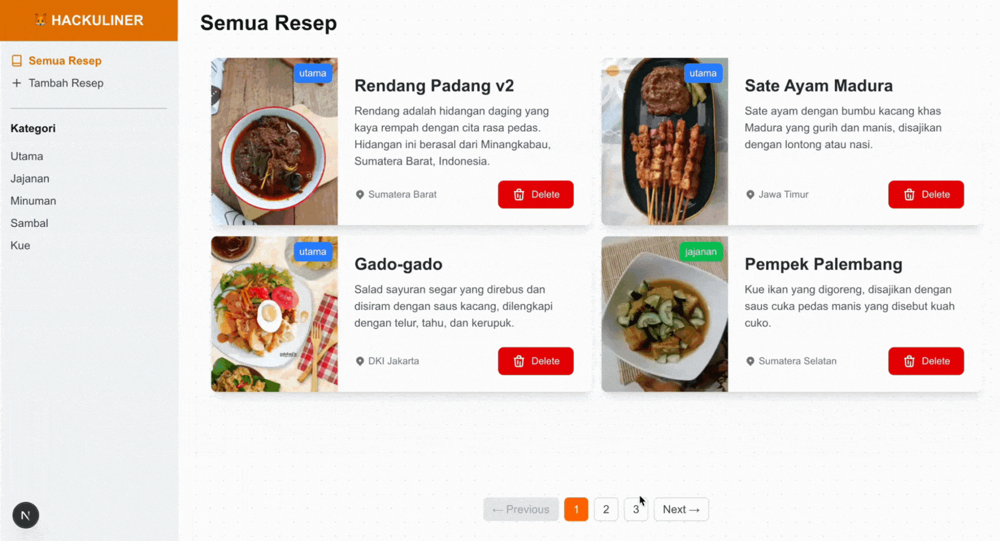

[](https://classroom.github.com/online_ide?assignment_repo_id=22273956&assignment_repo_type=AssignmentRepo)
# FSJSP3S7-LC01 - Hackuliner

## Ringkasan

Pada tugas kali ini kalian akan membuat sebuah aplikasi bernama `Hackuliner`. Dalam aplikasi ini kalian akan menampilkan berbagai macam `Resep Masakan` dari seluruh Indonesia. Kalian juga dapat menambahkan `Resep` baru ke dalam koleksi kalian.

## Aturan & Kebijakan

-   Waktu Pengerjaan: **180 min** (3 jam)
-   Student diharapkan menjunjung tinggi INTEGRITAS. Segala bentuk ketidakjujuran meliputi contek, kerjasama, peniruan, plagiarisme, pemalsuan pengerjaan, penggunaan AI, dsb akan mendapatkan tindakan tegas dari akademik (Score 0 & SP)
-   **WAJIB** melakukan **share screen** (**DESKTOP/ENTIRE SCREEN**), **open cam** dan **unmute microphone**.
-   **Pada text editor hanya ada file/folder yang terdapat pada repository ini & dilarang keras mengaktifkan AI tools**.
-   Dilarang membuka repository lain (**setelah melakukan clone, close tab GitHub pada web browser kalian**)
-   Hanya diperbolehkan membuka website dokumentasi resmi.
-   Error minimal ditampilkan menggunakan `console.log` di client
-   (-10) jika `node_modules` tidak diignore
-   (-5) jika `package.json` tidak ada, tidak valid atau tidak dipush
-   (-5) jika tidak menyertakan example value `.env` bagi yang menggunakan dotenv
-   (-5) Error tidak ditampilkan pada client

## Bobot Penilaian

-   Typescript
-   NEXT.js
-   Reusable Component

## Components

Buatlah client side kalian yang terdiri dari beberapa component-component berikut:

-   Home Page
-   Navbar
-   Recipe Card
-   Add New Recipe Page
-   Recipe Detail Page
-   Edit/Update Recipe Page
-   Recipe based on Category Page
-   Pagination Component

## Github Live Code Workflow

Dalam pengerjaan live code, kalian diminta untuk melakukan commit sebagai checkpoin pengerjaan. Jika pengerjaan release sudah selesai, segera lakukan `add-commit` dengan message relase yang jelas.

-   Contoh 1: git commit -m "Release 0 Done"
-   Contoh 2: git commit -m "Release 3 - Fetch: Done"

Instructor juga akan meminta commit dalam waktu tertentu, pastikan kalian melakukan `add-commit` juga ketika instructor meminta melakukan commit.

## Release 0: Setup Project

Silahkan gunakan `json-server` sebagai database pada aplikasi ini. Buatlah file `db.json` Anda sendiri. Skema dari aplikasi ini adalah sebagai berikut:

```JSON
{
  "recipes": [
    {
      "id": "1",
      "name": "Rendang",
      "description": "Rendang adalah hidangan daging yang kaya rempah dengan cita rasa pedas. Hidangan ini berasal dari Minangkabau, Sumatera Barat, Indonesia.",
      "origin": "Sumatera Barat",
      "image": "https://i.ibb.co/M8x11S1/rendang.jpg",
      "category": "Makanan Utama"
    }
  ]
}
```

Pada sisi client, Lakukan setup project dengan menginstall package yang sudah diajarkan sebelumnya:

1. Next.js
2. Typescript
3. Eslint
4. CSS Framework

Pada Live Code ini, kalian dibebaskan membuat design aplikasi yang kalian kerjakan namun pastikan aplikasi memiliki layout yang baik dan rapi agar mendapatkan nilai maksimal.

## Release 1: Home Page

Buatlah sebuah halaman pada path `/` yang akan menampilkan kumpulan `Resep` yang tersedia pada server.

Pada setiap item terdapat data:

1. Gambar masakan
2. Nama masakan
3. Kategori masakan (wajib dalam bentuk badge)
4. Deskripsi singkat
5. Daerah asal

> Notes: Wajib menggunakan server component (SSR) dan fetch data di server



## Release 2: Add New Recipe

Buatlah halaman baru dengan path `/add-recipe` yang terdapat sebuah form untuk menambahkan `Resep` baru kedalam database.
Data yang dapat di input untuk `Resep` baru kita adalah:

-   Name: `text input` untuk nama masakan
-   Origin: `text input` untuk daerah asal masakan
-   Description: `text area` untuk deskripsi masakan
-   Image (url): `text input` untuk gambar masakan berupa sebuah url
-   Category: `select option` untuk kategori masakan dengan pilihan: `Makanan Utama`, `Jajanan`, `Minuman`, `Sambal`, dan `Kue`.

Pastikan user kembali ke halaman `/` ketika berhasil menyimpan data `Resep` dan `Resep` yang baru kalian buat akan ada pada halaman `/`.

> Notes: Pada halaman ini dapat kamu buat dengan menerapkan server component atau client component.



## Release 3: Detail Recipe

Lakukanlah sebuah action ketika user menekan sebuah item yang berada di halaman utama. Action yang akan dilakukan adalah mengarahkan user ke halaman `/recipes/:id` yang menampilkan detail dari `Resep` yang dipilih oleh user.

Data yang ditampilkan pada halaman `/recipes/:id` adalah:

1. Gambar masakan
2. Nama masakan
3. Daerah asal
4. Kategori masakan
5. Deskripsi lengkap

> Notes: Wajib menggunakan server component (SSR) dan fetch data di server



## Release 4: Update/Edit Recipe

Implementasikan Button Edit/Update pada pada halaman Detail Resep (Release 3). Buat halaman `/recipes/:id/edit` yang menampilkan form dengan data Resep yang sudah ada, sehingga user dapat memperbarui informasi Resep tersebut. Setelah berhasil update, arahkan user kembali ke halaman Detail Resep `/recipes/:id`.

> Notes: Pastikan validasi form juga diterapkan pada fitur edit ini.



## Release 5: Delete Recipe

Implementasikan button `delete` pada setiap item di halaman `/` yang akan menghapus data `Resep` tersebut pada database. Buatlah konfirmasi dialog sebelum data berhasil dihapus. Data yang berhasil dihapus tidak ditampilkan lagi pada kumpulan `Resep` di halaman `/`.



## Release 6: Filter Recipe by Category

Buatlah halaman dengan path `/utama`, `/jajanan`, `/minuman`, `/sambal`, `/kue` untuk menampilkan `Resep` yang memiliki kategori sesuai dengan path yang diminta.


## Release 7: Validasi Form

Pada release 2 dan 4, buatlah validasi ketika user ingin membuat resep baru dan mengupdate data resep dengan rules:

-   Semua input harus terisi sebelum menyimpan data ke database, jika ada yang belum terisi, infokan dengan message yang jelas
-   Tampilkan sebuah feedback ketika ada data yang belum terisi pada form, feedback ini dapat berbentuk modal atau toast atau package lainnya tetapi tidak diperbolehkan menggunakan fungsi `alert()` javascript.



## Release 8: Pagination

Implementasikan fitur pagination pada halaman utama (`/`) agar daftar Resep dapat ditampilkan secara bertahap (6 data per halaman). Tampilkan navigasi untuk berpindah halaman (next, previous, dan nomor halaman). Buatlah logic untuk menambahkan property active pada nomor halaman dan disabled pada button previous-next sesuai dengan semestinya.

> Notes: nomor halaman dinamis menyesuaikan jumlah data.


